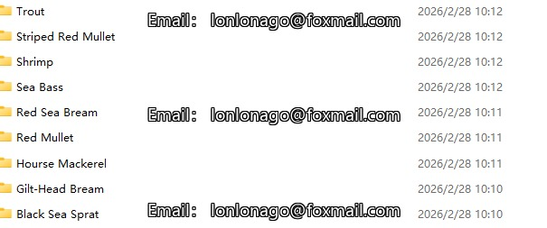
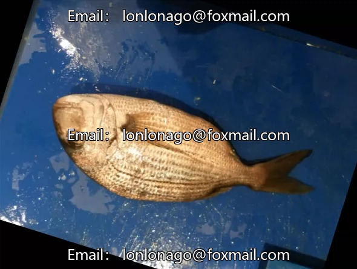

## Body

Large-Scale Fish Dataset

This dataset contains 9 different types of seafood collected from a supermarket in Izmir, Turkey.
The data was collected for a university-enterprise collaboration project at the University of Economics in Izmir, and the research findings were published in the ASYU conference in 2020.
The dataset includes image samples of goldhead snapper, red seabream, sea bass, red mullet, mackerel, black sea bream, spotted red mullet, trout, and shrimp.

These images were captured by two different cameras, Kodak EasyShare Z650 and Samsung ST60.
Therefore, the resolutions of these images are 2832 x 2128 and 1024 x 768, respectively.
Before performing segmentation, feature extraction, and classification operations, the dataset was resized to 590 x 445 while maintaining the aspect ratio. After resizing the images, all labels in the dataset were expanded (including flipping and rotation).

At the end of the enhancement process, the total number of images per category reached 2000; among them, there are 1000 RGB fish images and their corresponding paired real labels as well.

Dataset Description
The dataset contains 9 different types of seafood. For each type, there are 1000 enhanced images and their corresponding enhanced real labels.
Each category can be found in the "Fish_Dataset" file with its real labels. All images from each category are ordered from "00000.png" to "01000.png".

## Images

Here is a pay link on Stripe ( https://buy.stripe.com/3cs8yP7sY87d0vu9AB ). Please contact me lonlonago@foxmail.com after funding $89, and I will send you a complete data files , thank you!

